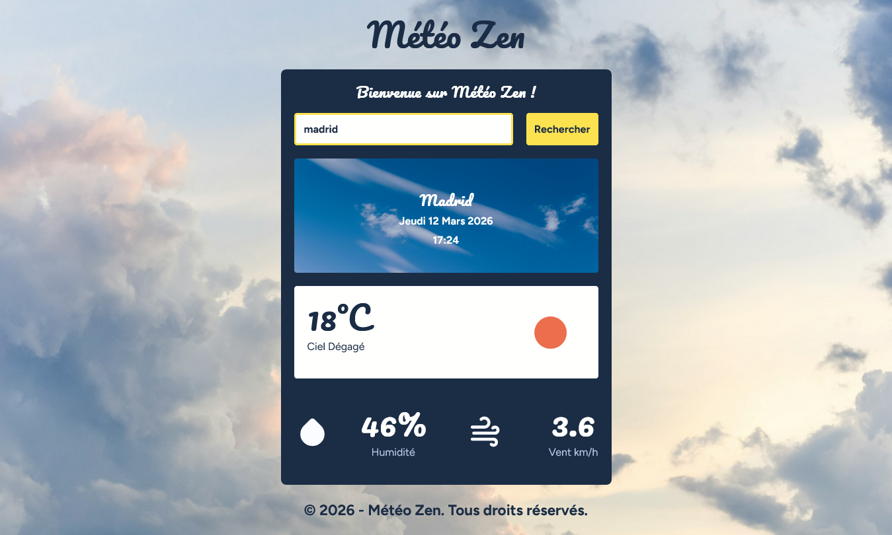

## APPLICATION METEO ☀️ 🌞 ☁️ ⛅ ⛈️ 🌤️ : METEO ZEN

## Le challenge

Création d'une application météo dynamique et responsive avec une recherche de ville, un affichage des données météo en temps réel (via l'API OpenWeatherMap), de la date et de l'heure.

## 🔑 Clé API OpenWeatherMap

Voici les étapes nécessaires afin d'obtenir une clé pour l'API OpenWeatherMap:

- Créer un compte sur openweathermap.org
- Obtenir une clé API gratuite

## Démonstration

Lien vers le projet : https://aperbet56.github.io/meteo_zen/

## Projet développé avec

- Utilisation des balises sémantiques HTML5
- CSS3
- Flexbox
- Animations CSS
- Grid
- Importation des polices "Pacifico" et "Figtree"
- Utilisation d'un normaliseur : le fichier normalize.css
- Page web responsive
- Desktop first
- Préchargement de certaines images
- Commentaires HTML
- Commentaires CSS
- JavaScript
- Code JavaScript commenté
- fetch
- async et await
